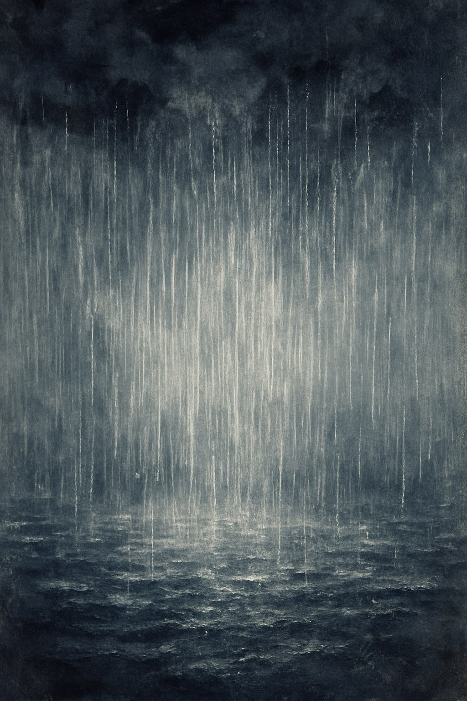

# Ureureung Kwak-Kwak-Kwak
[Stella Jang’s “Ureureung Kwak-Kwak-Kwak”](https://youtu.be/MXY08fPiqdA?si=bTlbg0R_cUfy24B_) is said to have been inspired by the childhood imagination of the ceiling disappearing and rain pouring down just before falling asleep. However, when I looked closely at the lyrics, I felt that the scene was not entirely romantic.

“Rain pouring down into my room 
My blanket soaked completely 
I couldn’t run away 
I just sat there blankly on the bed 
Ureureung Kwak-Kwak-Kwak-Kwak”

The narrator does not try to avoid the downpour, but simply sits on the bed and lets it fall helplessly. This rain seems to symbolize a wave of anxiety that arrives suddenly and inevitably, and the narrator is not resisting it but rather letting themselves sink into it.
The lyrics and musical atmosphere together convey this sense of anxiety. The song maintains a steady, repetitive rhythm with almost no significant variation, making the emotion feel less like an explosive outburst and more like a quiet yet continuous pressure weighing on the mind. The vocals are delivered in a calm and slightly flattened tone without excessive force, suggesting not an attempt to express or overcome the emotion, but a state of resignation and acceptance. In addition, the minimal changes in tone color and dynamic intensity throughout the song create the impression that the emotional flow is held down and still, allowing the listener to feel a sense of anxiety that does not erupt but slowly spreads and settles in.
The word “anxiety” never appears directly in the lyrics. However, the imagery of dark clouds and cold rain, the subdued melodic movement, and the restrained vocal delivery sensorially convey the feeling of anxiety quietly rising and filling one’s inner space. I think this song delicately and honestly portrays the moment of being slowly immersed in an emotion that one cannot easily escape.

This approach—expressing emotion not as a clinical diagnosis but as a quiet sensation permeating the inner world—also appears in other works. [Billie Eilish’s "listen before i go"](jung-yunjin.md) uses minimal piano accompaniment and faint ambulance sirens to evoke the texture of “collapsed depression” with unsettling realism, and this resonates with how Ureureung Kwak-Kwak-Kwak employs repetitive rhythms and the dark imagery of rain to portray “quietly encroaching anxiety.” Both songs avoid naming the emotion outright; instead, they reveal psychological distress through restrained dynamics, environmental sounds, and sensory imagery. In doing so, they share a similar expressive strategy—treating mental pain not as a medical category, but as a lived and felt experience.

# 우르릉 쾅쾅쾅
[스텔라장의 <우르릉 쾅쾅쾅>](https://youtu.be/MXY08fPiqdA?si=bTlbg0R_cUfy24B_)이라는 곡은 어렸을 때 잠들기 전 천장이 사라지고 비가 쏟아지는 낭만적인 상상을 했던 경험에서 만들어진 곡이라고 한다. 그러나 가사를 자세히 본 후, 그 장면이 마냥 낭만적이지만은 않다고 느꼈다.

“내 방을 덮치는 소나기 
흠뻑 다 젖어버린 이부자리  
난 도망도 가지 못하고 
그저 멍하니 침대 위에서 듣고 있었어 
우르릉 쾅쾅쾅쾅”

노래의 화자는 소나기를 피하려 하지 않고, 그저 침대 위에서 무기력하게 비를 맞는다. 이 소나기는 피할 수 없이 갑작스럽게 밀려오는 불안을 상징하는 것처럼 보이며, 화자는 이를 저항하기보다 그대로 잠겨버리는 상태에 놓여 있다. 노래의 가사와 음악의 분위기는 불안이라는 감정을 잘 드러내고 있다. 곡 전체는 크고 작은 리듬 변화가 거의 없고 일정하고 반복적인 박자를 유지하는데, 이는 불안이 순간적으로 폭발하는 감정이 아니라 조용하지만 지속적으로 마음을 누르는 감각으로 다가오게 한다. 또한 보컬은 힘을 과도하게 주지 않은 담담하고 평평한 톤으로 불려지며, 이는 감정을 드러내거나 벗어나려는 의지가 아닌 그저 받아들이는 체념의 상태를 표현하는 듯 하다. 여기에 음색 변화와 목소리 강약의 기복이 거의 없는 노래의 진행은 감정의 흐름이 가라앉아 고정된 듯한 인상을 주어, 청자로 하여금 마치 무너지는 대신 조용히 잠식되는 불안을 함께 느끼도록 만드는 것 같다. 곡 전체에서 ‘불안’이라는 단어는 직접적으로 등장하지 않는다. 그러나 먹구름과 차가운 빗줄기라는 단어의 이미지, 가라앉은 멜로디 라인, 그리고 감정을 과하게 드러내지 않는 보컬 표현 방식은 불안이 천천히 스며들어 차오르는 감정을 감각적으로 전달한다. 이 곡은 피하려 해도 쉽게 벗어날 수 없는 감정 속에 천천히 잠겨가는 순간을 섬세하고 진솔하게 보여주고 있다고 생각한다.

이처럼 감정을 병명으로 규정하기보다 내면에서 조용히 스며드는 감각으로 풀어내는 방식은 다른 작품에서도 발견된다. [빌리 아일리시의 「listen before i go」](jung-yunjin.md)는 최소한의 피아노와 희미한 사이렌 소리를 사용해 ‘붕괴된 우울’의 질감을 현실적으로 재현하는데, 이는 <우르릉 쾅쾅쾅>이 반복적 리듬과 어두운 비의 이미지를 통해 ‘조용히 잠식되는 불안’을 표현하는 방식과 맞닿아 있다.
두 작품 모두 감정을 직접적으로 명명하지 않고, 사운드의 기복·환경음·이미지적 장치를 통해 심리적 고통을 감각적으로 드러낸다는 점에서 동일한 표현 전략을 공유한다. 이처럼 감정을 병명으로 규정하기보다, 내면에서 조용히 스며드는 감각으로 풀어내는 방식은 다른 작품에서도 발견된다. 정신적 고통을 의학적 분류가 아닌 ‘겪어지는 경험’으로 바라본다는 점에서 비슷한 시각을 공유한다고 느껴진다.
