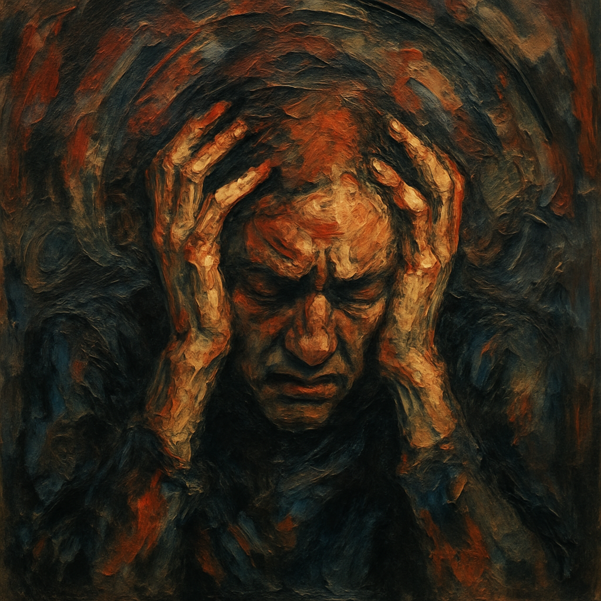

# Boléro

Ravel’s [Boléro](https://youtu.be/alBQFJjniV0?si=gALZQX5UV7fH-erB) builds its entire fifteen-minute structure on the obsessive repetition of one melody and an unchanging snare-drum rhythm. As the volume and instrumentation gradually expand, the music creates a slow, almost suffocating rise in tension. This repetitive design reflects not only the nature of obsessive thoughts but also echoes Ravel’s late-life neurological decline, which weakened his motor and linguistic control. To listeners, Boléro often feels hypnotic at first, then steadily overwhelming, as if a single idea were growing heavier and harder to escape.

A related work that also engages with obsession is Berlioz’s Symphonie Fantastique ([huh-hoyoung.md]). Both pieces portray the conflict between inner impulses and the struggle for control, transforming obsessive states into artistic expression. However, the nature of their obsession differs clearly: Symphonie Fantastique depicts psychological madness driven by obsessive love and opium-induced hallucination, whereas Boléro expresses a physical and mental buildup of compulsive tension through relentless rhythmic repetition.

# 볼레로(Boléro)

라벨의 [볼레로](https://youtu.be/alBQFJjniV0?si=gALZQX5UV7fH-erB)는 약 15분 동안 하나의 선율과 변화 없는 스네어드럼 리듬을 반복하며 점차 음량과 악기를 확장해 나간다. 이 구조는 처음에는 최면적이지만, 시간이 지날수록 점차 압박감이 쌓이는 느낌을 준다. 이러한 단조로운 반복은 강박적 사고의 끈질김을 드러내는 동시에, 생애 말기에 운동조절과 언어 기능이 약화되며 통제력을 잃어가던 라벨의 신경학적 퇴행과도 연결된다. 감상자에게는 하나의 생각이 서서히 무게를 더해 도망치기 어려워지는 듯한 경험을 제공한다.

비슷하게 강박 장애에 대해 다루는 작품으로 [환상교향곡](huh-hoyoung.md)이 있다. 두 작품 모두 내면의 충동과 통제 사이의 긴장을 음악적으로 표현하며, 병적 집착이 예술적 형식으로 승화되는 과정을 보여준다. 그러나 두 작곡가가 다룬 강박의 성격은 뚜렷하게 다르다. 환상교향곡이 짝사랑과 집착에서 비롯된 심리적 광기를 아편 환각 속 환상으로 묘사한다면, 볼레로는 동일한 리듬과 선율의 끊임없는 반복을 통해 신체적 붕괴와 강박적 긴장이 점차 쌓여가는 과정을 표현한다.
