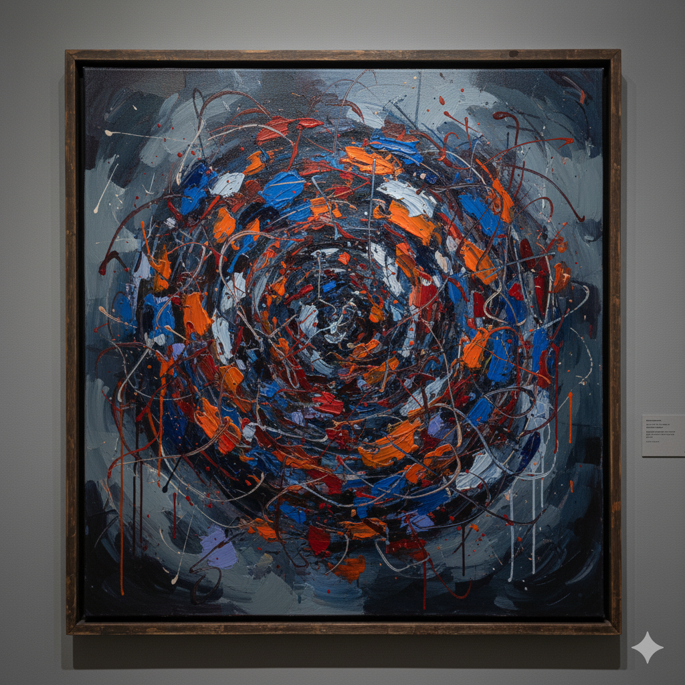

# Me Before You

Thea Sharrock’s Me Before You (2016) tells the story of Will, a talented and wealthy man who becomes paralyzed after an accident, and Louisa, a bright and cheerful woman who starts working as his caregiver. As Will faces his decision about assisted suicide, the two fall deeply in love with each other. One of the main themes of this film is Ed Sheeran’s (1991) song Photograph. The song is about how powerful love can be in our lives. Even if two people drift apart, the happiness captured in a photograph lasts forever, and the song expresses the desire to keep that moment alive in their hearts. This music plays during the scene where [Louisa and Will attend the wedding of Will’s ex-girlfriend and his friend, dancing together](https://youtu.be/H_z63kWV-80?si=Kte5EtgepZjaRbFI) as the background song flows. Although they sit together on Will’s wheelchair and attract everyone’s attention, they focus solely on each other, sharing a moment of pure happiness amidst the crowd. Just like the lyrics suggest, this moment may not last forever, but it will remain vividly in their hearts like a photograph that never fades. Even Will’s pain will remain only as a part of the beutiful memory captured in the photograph.

When compared with the drama [Extraordinary Attorney Woo](kim-junho.md), both texts interpret how particular scenes or songs reveal the characters’ emotions and relationships, emphasizing that music and imagination are not merely background elements but carry emotional significance. However, while the first text focuses on the endurance of love and shared memories between the lovers, the analysis of Woo Young-woo highlights how a person on the autism spectrum uses “imagination” as a way to protect herself and to connect with others.

# 미 비포 유

테아 샤록의 Me before You(2016)는 사고로 전신마비가 된 능력 있는 재력가 윌과 그의 간병인으로 취직한 밝고 활기찬 루이자가 윌의 조력 사망을 앞두고 서로에게 사랑에 빠지는 이야기이다. 이 영화의 main theme 중 하나는 Ed Sheeran(1991)의 Photograph이다. Phptograph는 사랑이 살아가면서 얼마나 큰 힘을 가지는지에 관한 곡이다. 둘이 멀어지더라도 사진 속 둘의 행복하던 때는 영원하며 이 모습을 가슴 속에 영원히 간직할 것을 노래한다. 이 음악은 루이자와 [윌이 윌의 전 여자친구와 친구의 결혼식에 참석해 함께 춤을 추는 장면](https://youtu.be/H_z63kWV-80?si=Kte5EtgepZjaRbFI)에서 배경음악으로 흐른다. 비록 윌의 휠체어 위에 나란히 앉아 사람들의 시선을 한몸에 받지만, 수많은 인파 속에서도 두 사람은 오직 서로에게만 집중하며 행복한 시간을 보낸다. 가사처럼 이 순간이 영원하지는 않겠지만, 두 사람의 마음속에는 마치 한 장의 사진처럼 언제까지나 선명하게 남을 것임을 느낄 수 있다. 윌의 아픔 마저도 사진 속에서는 그저 아름다운 추억의 한 부분으로 남을 것이다.

드라마 [이상한 변호사 우영우](kim-junho.md)와 비교했을 때 두 글 모두 작품 속 장면이나 노래가 인물의 감정과 관계를 어떻게 드러내는지를 해석하며, 음악·상상이 단순한 배경 요소가 아니라 정서적 의미를 지닌다는 점을 강조한다. 하지만 앞선 글은 연인의 사랑과 추억의 지속성에 초점을 두는 반면, 우영우 글은 자폐 스펙트럼을 지닌 인물이 ‘상상’을 통해 자신을 보호하고 타인과 연결하는 방식에 초점을 둔다.
