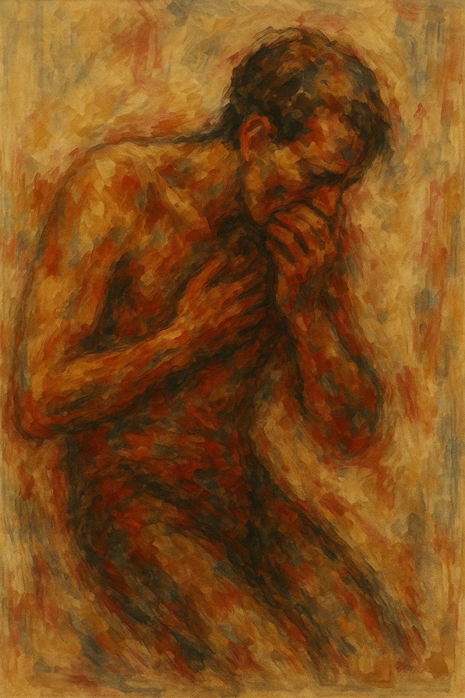

# La Traviata

The opera La Traviata features the aria “[Addio del passato](https://www.youtube.com/watch?v=ug9gWXlyuDs)”, composed by Giuseppe Verdi. Verdi, born in Italy in 1813 and passing away in 1901, was one of the leading opera composers of the Romantic era. This aria is sung by the protagonist Violetta as she lies on her deathbed, suffering from tuberculosis. During the 19th century, tuberculosis was not only a devastating illness but also a culturally symbolic one—often portrayed in art and literature as a slow and tragic fading of life, which added a sense of fragile beauty to characters who suffered from it. Seen in this context, Violetta’s final reflections gain an additional layer of meaning: as she recalls the happiness and love of her past, prays for divine forgiveness, and quietly accepts her approaching death, she embodies the era’s perception of the disease as both physically consuming and emotionally purifying. Verdi delicately portrays the fading vitality caused by the disease through music. The gentle rhythm, the soft resonance of the strings, and the chromatic progressions vividly convey the limits of the body and the nearness of death. Listening to the aria feels like time itself slows down. Violetta’s sorrow and serenity intertwine, and the music becomes not merely an accompaniment but the “last breath” connecting her fragile body with her final emotions.

In the film [Les Misérables](ki-hayoon.md), which also deals with tuberculosis, music is used in a different way. In the film, the song “I Dreamed a Dream” appears, and its slow tempo and simple piano accompaniment in the beginning express the character Fantine’s harsh poverty and despair. In the latter part of the song, the short and unstable breathing, trembling vibrato, and the strained high notes convey the fatigue, shortness of breath, and pain caused by tuberculosis. Furthermore, as the melodies of all the instruments gradually fade toward the end, the song reflects society’s moral indifference toward the suffering of tuberculosis patients, as if people have closed their ears to the pain of others.

# 라 트라비아타

오페라 라 트라비아타에는 주세페 베르디가 작곡한 아리아 “[과거여 안녕(Addio del passato)](https://www.youtube.com/watch?v=ug9gWXlyuDs)”가 등장한다. 이탈리아에서 1813년에 태어나 1901년에 생을 마감한 베르디는 낭만주의 시대를 대표하는 오페라 작곡가였다. 이 아리아는 결핵으로 죽음을 앞둔 비올레타가 임종의 순간에 부르는 노래다. 19세기 당시 결핵은 치명적인 질병인 동시에 예술과 문학에서 삶이 서서히 사라지는 비극적 아름다움의 상징처럼 표현되던 문화적 의미를 지니고 있었다. 이러한 시대적 인식을 고려하면, 비올레타가 지나온 행복과 사랑을 떠올리고 신의 용서를 구하며 다가오는 죽음을 조용히 받아들이는 장면은 그녀 개인의 서사뿐 아니라 그 시대가 결핵을 바라보던 정서까지 함께 담아내고 있어 더욱 깊은 울림을 준다. 베르디는 음악을 통해 병세로 인해 점차 희미해져 가는 생명력을 섬세하게 묘사한다. 부드러운 리듬, 잦아드는 현악기의 울림, 반음계 진행은 육체의 한계와 죽음의 임박함을 생생하게 전달한다. 이 아리아를 듣다 보면 시간이 느리게 흐르는 듯한 감각이 들고, 비올레타의 슬픔과 평온함이 함께 얽혀 음악은 단순한 반주를 넘어 그녀의 연약한 육신과 마지막 감정들을 잇는 일종의 ‘마지막 숨결’처럼 느껴진다.

결핵을 다루는 영화 [레미제라블](ki-hayoon.md)에서는 음악이 다른 방식으로 사용된다. 영화에서는 노래 "I Dreamed a Dream"가 나오는데 이 노래는 초반부의 느린 템포와 단조로운 피아노 반주로 등장인물 판틴의 가혹한 빈곤과 절망을 나타낸다. 또한 곡의 후반부에는 짧고 불안정한 호흡, 떨리는 비브라토와 억지로 짜내는 듯한 고음으로 결핵에 의한 피로, 호흡곤란 그리고 고통을 느끼게 해준다. 또한 곡에서는 후반부에 모든 악기 선율이 희미하게 줄어듬을 통해 타인의 고통에 귀를 막아버리며 결핵 환자들을 향한 사회의 도덕적 무관심을 보여준다.
