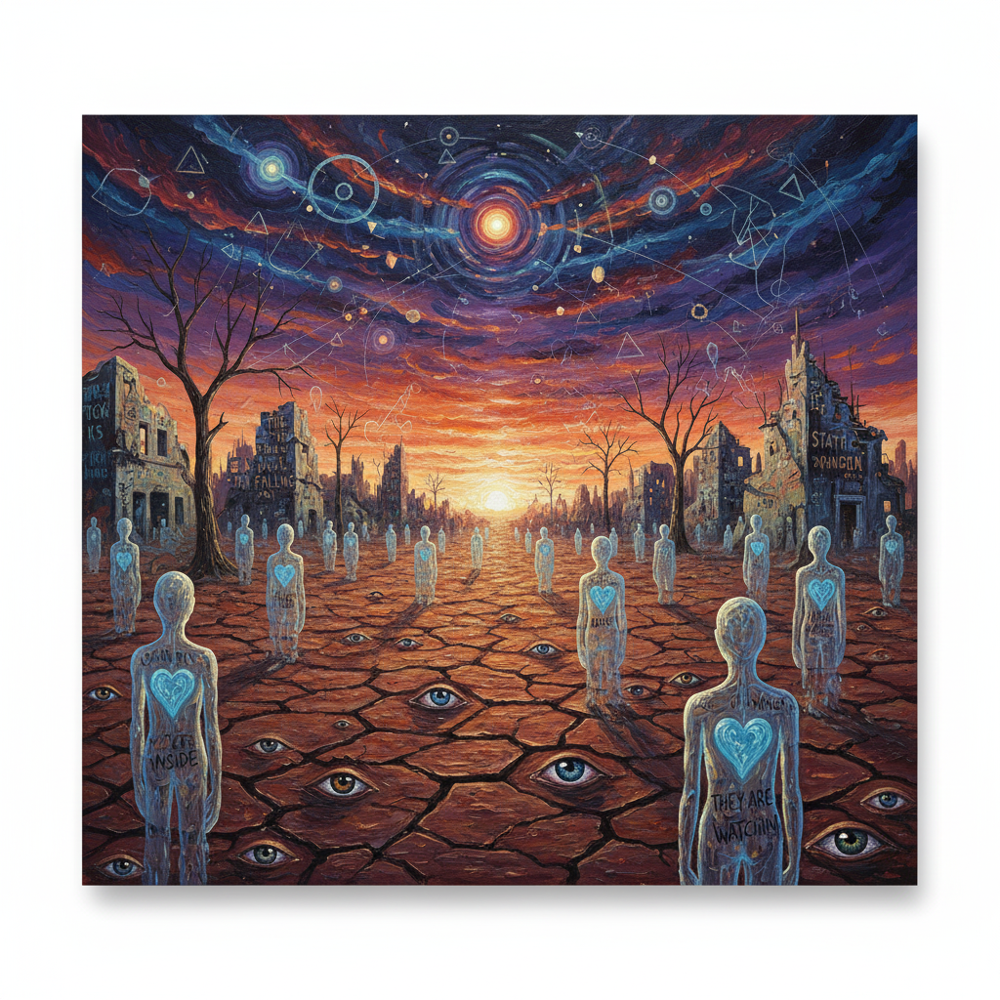

# A Beautiful Mind (2001)

The film A Beautiful Mind (2001) is based on the life of the real-life genius mathematician John Nash, who gained fame for his extraordinary mathematical achievements but struggled with schizophrenia, experiencing hallucinations and delusions that made it difficult for him to distinguish reality from illusion. The music, A Kaleidoscope of Mathematics by James Horner (1953–2015), combines orchestra and female choir with steady rhythms and irregular melodies, reflecting both Nash’s brilliance and the confusion caused by his disorder. Through this blend, the score portrays schizophrenia not merely as an illness but as an inner world where reason and hallucination intersect, allowing the audience to experience the protagonist’s mental turmoil. Ultimately, with his wife’s devoted love and his own determination, Nash overcomes the illness and achieves the Nobel Prize, and the music reinforces the film’s central message about the power of human resilience and the intersection of intellect, emotion, and recovery.

[“Pierrot lunaire”](kim-jieun.md) also portrays Schizophrenia the same ways as the movie "A Beautiful Mind". John Nash perceives imaginary people as real, while Pierrot falls into delusions and hears the moon calling him. In both cases, the characters become isolated from others as they lose touch with reality. The film and the opera use realistic hallucinations and strong symbolic imagery to let the audience experience the characters’ subjective worlds. Ultimately, both works treat schizophrenia not as strange behavior, but as a profound struggle within the human mind.

[“A Kaleidoscope of Mathematics”](https://www.youtube.com/watch?v=eamiiuUmVz8&list=RDeamiiuUmVz8&start_radio=1) is the main theme of A Beautiful Mind, composed by James Horner, and it uses repeating piano and string patterns that gradually grow more complex to reflect John Nash’s mathematical way of perceiving the world. Charlotte Church’s clear, ethereal vocals add a sense of both brilliance and fragility, capturing the tension between Nash’s genius and his vulnerable inner life. The piece ultimately symbolizes the film’s blend of intellectual elegance and emotional depth.

# 뷰티플마인드

영화 〈뷰티풀 마인드〉(2001)는 천재 수학자 존 내쉬의 삶을 바탕으로, 뛰어난 업적에도 불구하고 조현병으로 환각과 망상 속에서 현실과 환상을 구분하지 못하며 고통받는 내쉬를 그린다. 제임스 호너의 음악 「A Kaleidoscope of Mathematics」는 오케스트라와 여성 합창을 규칙적인 리듬과 불규칙한 멜로디로 조화시켜, 내쉬의 천재성과 정신적 혼란을 동시에 표현한다. 이 음악은 조현병을 단순한 질환이 아닌 이성과 환상이 교차하는 내면 세계로 묘사하며, 관객이 주인공의 정신적 혼란을 간접적으로 체험하도록 돕는다. 결국 내쉬는 아내의 헌신적인 사랑과 자신의 의지로 병을 극복하고 노벨상을 수상하며, 음악은 혼란 속에서도 인간의 의지와 회복력을 강조하는 중요한 장치로 작용한다.

조현병을 다루는 또 다른 영화 [달에 홀린 피에로](kim-jieun.md) 에서 또한 조현병을 현실과 환상이 뒤섞이는 질환으로 그린다. 존 내쉬는 존재하지 않는 인물들을 실제 인물처럼 인식하고, 피에로는 달이 자신을 부른다는 환청과 망상에 빠지며 주변과 단절된다. 두 작품은 이러한 과정에서 인물이 사회와 멀어지는 고립감을 보여주고, 현실처럼 느껴지는 환영과 강렬한 상징을 활용해 조현병 환자의 주관적 세계를 관객이 직접 체감하도록 만든다. 결국 두 작품은 조현병을 단순한 이상 행동이 아닌, 인간 내면의 고통과 싸움으로 진지하게 조명한다.

[“A Kaleidoscope of Mathematics”](https://www.youtube.com/watch?v=eamiiuUmVz8&list=RDeamiiuUmVz8&start_radio=1)는 제임스 호너가 작곡한 *〈뷰티풀 마인드〉*의 대표 테마 음악으로, 피아노와 현악기의 규칙적이며 점점 복잡해지는 패턴을 통해 존 내쉬의 수학적 사고와 세계 인식을 표현한 곡이다. 여기에 샬롯 처치의 맑은 보컬이 더해져 천재적인 아름다움과 동시에 섬세하고 불안정한 내면을 보여주며, 영화 전체의 지적이면서 감성적인 분위기를 상징하는 음악으로 사용된다.
