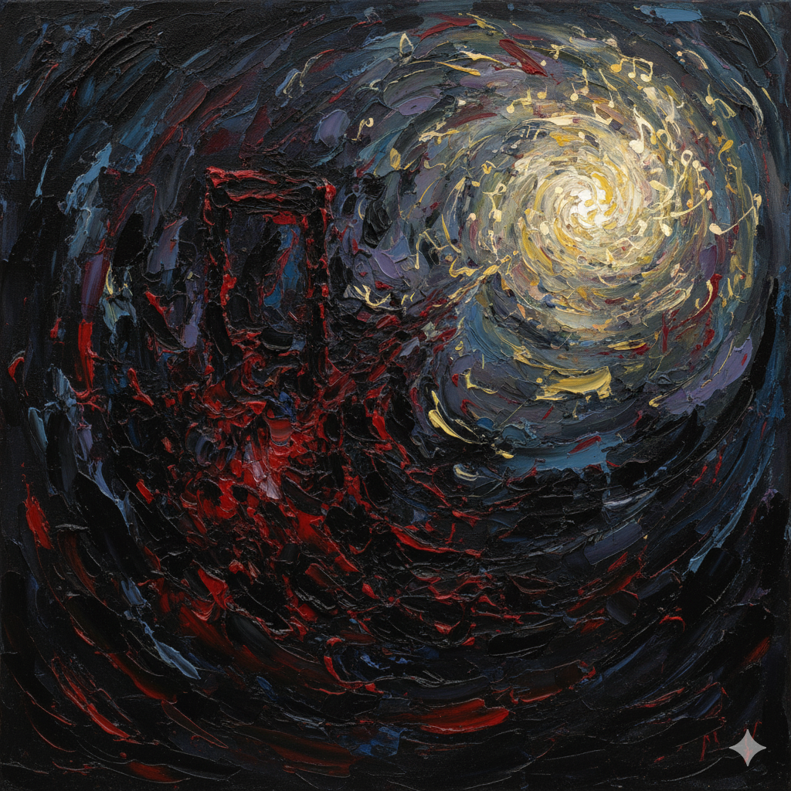

# Symphonie Fantastique (Op. 14, 1830)

Hector Berlioz (1803–1869) who composed [Symphonie Fantastique (Op. 14, 1830)](https://youtu.be/AEXJKQ8b1gM?si=pa3sh8PdxoL4MFLz) fell in love with the actress Harriet Smithson, who played Ophelia in a production of Hamlet. Despite numerous attempts to contact her, she did not respond. The obsessive love, despair, and emotional instability he experienced during this period served as the inspiration for this work. The storyline follows an artist who, in despair over unrequited love, takes poison but instead of dying, falls into vivid hallucinations, with each movement depicting various visions such as his own execution and a witches’ sabbath. This work is a musical psychological drama that audibly depicts the artist’s mental frenzy and hallucinations. The protagonist, having failed in love, becomes intoxicated with opium and falls into a world of hallucinations—a process expressed through distortions of the idée fixe melody and harsh dissonances in this programmatic symphony. In particular, the grotesque and brutal scenes of [the fourth and fifth movements](https://youtu.be/YjJvpSS4SMM?si=WVaeqiw5GwdBWulg)—where he kills his beloved and is himself executed— are expressed through strong orchestral harmonies and the clamorous tremolos of three timpanists and a snare drum player. Additionally, the sound of bells reminiscent of funeral tolling and the “Dies Irae” melody from the Gregorian Requiem aurally recreate the imagery of death within the hallucination. The composer Berlioz’s inner anxiety and emotional outbursts are revealed in extremis, reflecting his obsessional unrequited love, subsequent anger over a fiancée’s infidelity, and personal turmoil including his divorce from his first love, Smithson, who struggled with alcoholism.

In Symphonie fantastique, the melody known as the “idée fixe,” which symbolizes the beloved, recurs and transforms across multiple movements, reflecting the protagonist’s obsessive attachment. It also appears like auditory hallucinations in scenes where he perceives or recalls the beloved within his visions. This element of hallucination also appears in the OST “[Auditory Hallucination](han-junryul.md)” from the drama Kill Me, Heal Me. This piece expresses the chaotic inner world of a character experiencing dissociative identity disorder, particularly through overlapping voices that musically embody uncontrollable inner voices at the blurred boundary between reality and imagination. Listeners, too, experience a sense of unease and disorientation through this auditory layering of voices.

# 환상교향곡 (_Symphonie Fantastique_)

엑토르 베를리오즈 (1803-1869)는 햄릿 연극에서 오필리아 역을 맡은 여배우 해리엇 스미드슨을 보고 사랑에 빠져 수많은 연락 시도를 하지만 응답 받지 못하였다. 이 과정에서 느낀 집착적 사랑과 실의, 감정적 불안정을 배경으로 [환상교향곡](https://youtu.be/AEXJKQ8b1gM?si=pa3sh8PdxoL4MFLz)을 작곡했다. 줄거리는 한 예술가가 이루어지지 않은 사랑에 절망해 독을 마시지만, 죽음 대신 생생한 환각에 빠져들고 각 악장에서 자신의 처형, 마녀의 축제 등과 같은 다양한 환상을 보여주는 내용이다. 이 작품은 예술가의 정신적 광기와 환각을 청각적으로 구현한 음악적 심리극이다. 현실에서 사랑에 실패한 주인공이 아편에 취해 환상 속으로 빠져드는 과정을, ‘이드 픽스’ 선율의 왜곡과 불협화음으로 표현한 프로그램 교향곡이다. 특히 [4, 5악장](https://youtu.be/YjJvpSS4SMM?si=WVaeqiw5GwdBWulg)에서의 사랑하는 여인을 죽이고 스스로도 사형선고를 받아 죽는 잔혹하고 괴이한 장면들을 관현악의 강한 화음과 팀파니스트 세 명 및 스네어드럼 주자의 요란한 트레몰로로 표현한다. 또한 장례식의 타종을 연상케 하는 종소리와 그레고리오 성가의 레퀴엠 중 진노의 날 선율을 통해 환각 속 죽음의 이미지를 청각적으로 재현한다. 스토킹에 가까운 짝사랑에 실패하고 분노하며, 이후에도 약혼자의 불륜, 알콜중독에 빠진 첫사랑 스미드슨과의 이혼 등으로 인한 작곡가 베를리오즈의 내면적 불안과 감정의 폭발이 극단적으로 드러남을 확인할 수 있다.

환상교향곡은 사랑하는 여인을 상징하는 '이드픽스'라는 선율이 여러 악장에 걸쳐 변형하여 제시함으로서 주인공의 집착적인 태도를 보여준다. 또한 이는 주인공이 환상 속에서 여인을 목격하거나 떠올리는 장면에서 환청처럼 등장하기도 한다. 이러한 환청적인 요소가 드라마 킬 미 힐 미에 나온 "[환청](han-junryul.md)"이라는 OST에도 등장한다. 해리성 정체감 장애를 겪는 인물의 혼란스러운 내면을 표현하는 곡으로 특히 목소리가 겹쳐 들리는 구성을 통해 불분명한 현실과 상상의 경계 속에서 통제할 수 없는 내면의 목소리를 음악으로 형상화한다. 이를 듣는 청자 또한 목소리가 겹쳐들리는 청각적 장치로 인해 불안감과 혼란스러움을 간접적으로 체험하게 된다. 
