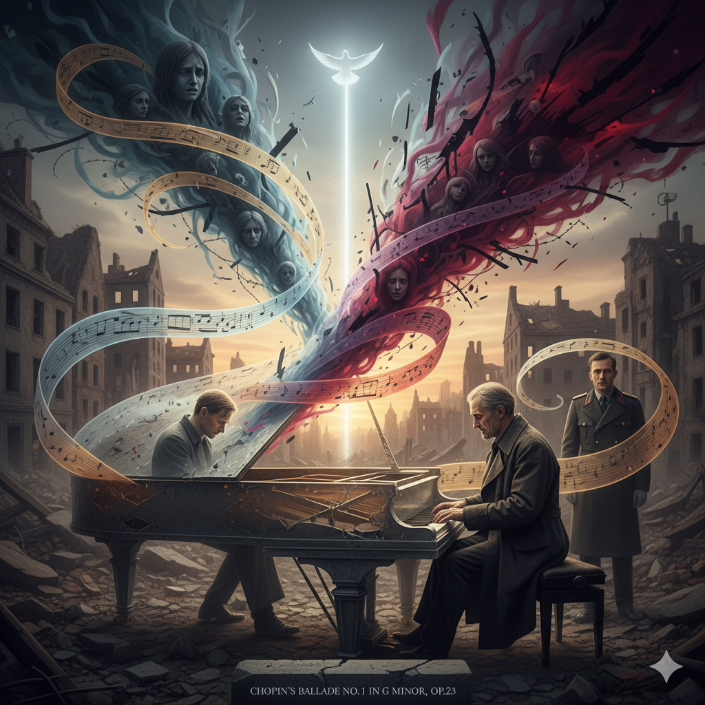

# The Pianist

The Pianist depicts the harrowing journey of Władysław Szpilman, a Jewish pianist who struggles to survive the Nazi invasion of Poland during World War II. Amid the ruins of war and the loss of his family, [Chopin’s Ballade No.1 in G minor, Op.23](https://www.youtube.com/watch?v=jHfQCfUTlXE&list=RDjHfQCfUTlXE&start_radio=1) becomes his sole means of preserving identity and humanity. The piece unfolds like an inner monologue—beginning with a calm, reflective melody that soon erupts into chaos, sorrow, and fleeting hope. Its dynamic contrasts and shifting tempos mirror the psychological turbulence of trauma, embodying Szpilman’s emotional oscillation between despair and endurance, much like the symptoms of post-traumatic stress disorder (PTSD). In the final scene, when Szpilman performs Ballade No.1 before a German officer in the devastated ruins of Warsaw, his trembling yet resolute playing transcends mere survival—it becomes a declaration of human dignity. The music bridges the gap between victim and oppressor, evoking empathy even in the midst of violence, and demonstrating how art can serve as an anchor of psychological resilience. Ultimately, the film illustrates that music is not only a refuge from suffering but a form of spiritual survival, proving that even in the darkest times, the power of art can heal, remember, and restore the essence of humanity.

Just as Chopin’s Ballade No. 1 in The Pianist functions as a “psychological refuge” that protects Szpilman’s identity and dignity, [Iron Man 3’s “Isolation”](song-jungbin.md) shows a similar pattern in the way it uses piano-centered music to reveal the inner landscape of PTSD. Just as Szpilman, scarred by the horrors of war, can barely confirm “myself as a human being” only when he sits at the piano, Tony Stark, suffering from post-traumatic stress disorder (PTSD, F43.1 / 6B40) after the Battle of New York, confronts his own anxiety through the solitary piano line and tense low strings that run beneath his insomnia, panic attacks, and hyperarousal. In particular, the dissonances and sudden dynamic contrasts translate core symptoms of PTSD—such as re-experiencing (flashbacks), anticipatory anxiety, and somatic fear responses—into sound, while the piano functions as an emotional regulation device that briefly stabilizes a fragmented, over-aroused self. In this way, the “piano–trauma” connection that begins in The Pianist continues in Iron Man 3, showing that, in different contexts—one centered on survival, the other on recovery—the piano becomes a medium through which PTSD is endured, processed, and given meaning.

 # 피아니스트 (*The Pianist*)

피아니스트는 제2차 세계대전 당시 나치의 폴란드 침공 속에서 유대인 피아니스트 블라디슬라프 스필만이 겪는 참혹한 생존의 여정을 그립니다. 가족을 잃고 모든 것을 빼앗긴 그는 오직 [쇼팽의 발라드 1번(Op.23)](https://www.youtube.com/watch?v=jHfQCfUTlXE&list=RDjHfQCfUTlXE&start_radio=1)을 통해 인간으로서의 정체성과 존엄을 지켜냅니다. 이 곡은 차분한 서두에서 시작해 절망과 분노, 그리고 희미한 희망으로 요동치는 심리적 서사를 담고 있으며, 변화무쌍한 리듬과 강약의 대비는 외상 후 스트레스(PTSD)처럼 불안정한 감정의 파도를 반영합니다. 영화의 마지막 장면에서 스필만이 폐허 속에서 독일 장교 앞에 앉아 발라드 1번을 연주하는 순간은 단순한 생존이 아니라 존엄의 선언이 됩니다. 떨리는 손끝에서 흘러나오는 음악은 적과 피해자의 경계를 잠시 허물며, 예술이 인간의 정신을 회복시키는 힘을 지녔음을 증명합니다. 결국 이 작품은 음악이 고통을 잠재우는 피난처를 넘어, 인간이 끝내 인간으로 남을 수 있게 하는 정신적 생존의 상징임을 보여줍니다.

피아니스트에서 쇼팽 발라드 1번이 스필만의 정체성과 존엄을 지켜 주는 ‘심리적 피난처’로 기능하듯, [아이언맨 3의 「Isolation」](song-jungbin.md) 역시 피아노를 중심으로 한 음악을 통해 PTSD의 내면을 드러낸다는 점에서 유사한 양상을 보인다. 전쟁의 참혹함을 겪은 스필만이 피아노 앞에서만 겨우 ‘사람으로서의 나’를 확인할 수 있었던 것처럼, 뉴욕 전투 이후 외상 후 스트레스 장애(PTSD, F43.1 / 6B40)에 시달리는 토니 스타크 역시 불면, 공황 발작, 과각성 상태 속에서 고독한 피아노 선율과 낮은 현악기의 긴장된 음색을 통해 자신의 불안을 마주한다. 특히 불협화음과 갑작스러운 강약 대비는 재경험(플래시백), 예기불안, 신체화된 공포 반응 등 PTSD의 핵심 증상을 소리로 번역해 내며, 피아노는 분열되고 과각성된 자아를 잠시 안정시키는 정서 조절 장치로 기능한다. 이처럼 피아니스트에서 시작된 ‘피아노-트라우마’의 연결 고리는 아이언맨 3에서도 이어지며, 한 인물의 생존과 다른 인물의 회복이라는 서로 다른 맥락 속에서 피아노가 PTSD를 견디고 의미화하는 매개체가 된다는 점을 보여준다.
