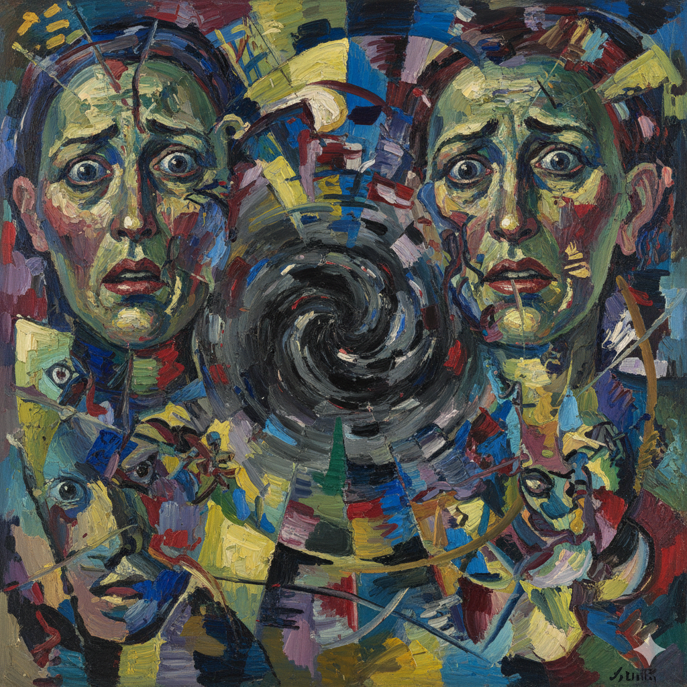

# A beautiful Mind

The song “All Love Can Be” from A Beautiful Mind does not depict schizophrenia through direct description; instead, it conveys the light of love and humanity that persists even within a distorted reality. The gentle piano and repeating string motifs symbolize Nash’s internal confusion and anxiety, while Charlotte Church’s clear, ethereal voice feels like a distant thread of reason—an intimate gesture of healing reaching through the noise. As the film progresses, the music gradually shifts into a calmer and more grounded tone, subtly mirroring Nash’s recovery and his deliberate choice to return to reality despite the presence of lingering hallucinations.

Rather than approaching the illness from a pathological perspective, the song expresses it through the language of emotion and redemption, sketching the dignity and warmth a person can still hold even in the midst of suffering. For example, the sustained low string drone represents a trembling inner landscape, while the transparent timbre of the vocal line layered above it sonically illustrates how love seeps through the cracks of fear. This contrast in textures gives persuasive musical form to the message of the title—“All Love Can Be”—allowing the song to embody the quiet power of love as something that steadies, consoles, and ultimately guides.

Schizophrenia and autism spectrum disorder (ASD) have distinct clinical characteristics, but some studies have suggested a partial association between the two based on shared abnormalities in neurodevelopmental processes. While ASD appears from early childhood with difficulties in social communication and repetitive behaviors, schizophrenia typically develops in young adulthood and presents with psychotic symptoms such as hallucinations and delusions, as well as negative symptoms like emotional blunting. Nevertheless, the two disorders share certain similarities in cognitive domains, including impairments in social functioning, atypical sensory processing, and difficulties in executive functioning, and some research has reported overlapping genetic risk factors. However, because they differ greatly in onset, clinical presentation, and treatment methods, clear distinction between them remains essential.

Meanwhile, the drama Extraordinary Attorney Woo focuses on the daily life and growth of its protagonist on the autism spectrum, encouraging greater social understanding of neurodiversity. The protagonist, Woo Young-woo, possesses exceptional memory and logical reasoning skills but struggles with interpreting social norms and nonverbal expressions, thereby realistically depicting the prejudice and structural barriers faced by autistic individuals. Furthermore, her gradual expansion of relationships and communication in her own way shows that autism spectrum disorder is not a deficit but a unique form of cognitive diversity, highlighting the importance of a society that embraces such diversity.

# 뷰티풀 마인드 

영화 A Beautiful Mind의 삽입곡 **〈All Love Can Be〉**는 조현병이라는 질병의 증상을 직접적으로 드러내기보다, 그로 인해 뒤틀린 현실 속에서도 여전히 존재하는 사랑과 인간성의 빛을 음악으로 드러내는 작품이다. 잔잔한 피아노와 반복되는 현악 선율은 내쉬의 내면을 휘감는 혼란과 불안을 상징하며, 샬럿 처치의 맑고 고요한 음성은 그 속에서 간신히 들려오는 이성의 목소리이자 그를 붙잡아 주는 치유의 손길처럼 다가온다. 특히 영화 후반부로 갈수록 음악이 차분하고 안정된 톤으로 변해가는데, 이는 환청과 환영 속에서도 현실을 선택하고자 하는 내쉬의 회복과 성숙한 결단을 조용히 반영한다.

이 곡은 질병을 병리적 시선이 아니라 감정과 구원의 언어로 풀어냄으로써, 고통 속에서도 인간이 지닐 수 있는 존엄과 따뜻함을 청각적으로 섬세히 그려낸다. 예를 들어, 낮게 깔리는 스트링의 지속음(drone)은 흔들리는 내면을 표현하는 동시에, 그 위에 쌓이는 보컬의 투명한 음색은 사랑이 불안의 균열 사이로 스며드는 순간을 청각적으로 시각화한다. 이러한 대비적 사운드는 “사랑이 할 수 있는 모든 것(All Love Can Be)”이라는 메시지를 음악적 층위에서 설득력 있게 완성한다.

조현병과 자폐스펙트럼장애는 서로 다른 임상적 특성을 지니지만, 신경발달 과정의 이상이라는 공통점을 바탕으로 일부 연관성이 제기되고 있다. 자폐스펙트럼장애가 영유아기부터 사회적 의사소통의 어려움과 반복행동으로 나타난다면, 조현병은 주로 청년기에 발병하여 환청·망상 등 정신병적 증상과 정서 둔마 같은 음성증상을 보인다. 그럼에도 두 질환은 사회적 기능 저하, 감각 처리의 비정상성, 실행기능의 어려움 등 인지 영역에서 일정 부분 유사성을 공유하며, 일부 유전적 위험 인자가 겹친다는 연구도 보고되고 있다. 그러나 발병 시기와 임상 양상, 치료 방식이 크게 다르기 때문에 명확한 구분은 필수적이다.

한편, 드라마 [이상한 변호사 우영우](cheong-yunho.md)는 자폐 스펙트럼을 가진 주인공의 일상과 성장을 중심으로 신경다양성에 대한 사회적 이해를 촉구하는 작품이다. 주인공 우영우는 뛰어난 기억력과 논리적 사고를 지니지만 사회적 암묵지와 비언어적 표현의 해석에는 어려움을 보이며, 이를 통해 자폐인이 마주하는 편견과 구조적 제약이 현실적으로 그려진다. 더불어 그가 자신의 방식으로 주변과 소통하며 관계를 확장해 나가는 모습은 자폐 스펙트럼이 결함이 아닌 고유한 인지적 다양성임을 보여주며, 다양성을 포용하는 사회의 중요성을 일깨운다.
