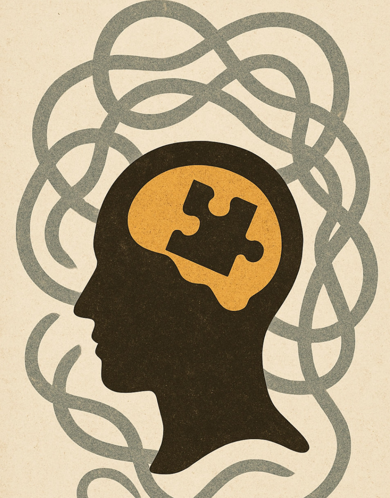

# Forrest Gump (1994)

1. Art Work
- Medium: Film  
- Title: Forrest Gump  
- Director: Robert Zemeckis  
- Music by: Alan Silvestri  
- Starring: Tom Hanks  
- Year of Release: 1994  

2. Music and Information
- Title: Forrest Gump – Original Motion Picture Soundtrack  
- Composer: Alan Silvestri (1950 –  )  
- Representative Track: **Feather Theme**  
- Musical Style: Orchestral / Film Score  
- Description: The melody’s gentle flow and repetition illustrate innocence, hope, and the cyclical nature of life and fate.  

3. Depiction of Disability in the Film
The film portrays the journey of the protagonist, Forrest Gump, who, with an intellectual disability, understands the world in his own way through chance and destiny. Alan Silvestri's "Feather Theme" not only depicts Forrest's inner world but also translates the visual symbol of the 'feather' that bookends the film into sound. The simple arpeggios on the piano and the soft harmonies of the strings audibly replicate the movement of the feather drifting aimlessly in the wind, while simultaneously capturing Forrest’s pure gaze and inner peace. The repetitive and varied melodies reflect Forrest’s cognitive trait of simple, intuitive thinking, and the unpredictable flow of his life is woven into both the visual symbol and musical patterns. Throughout the film, ‘disability’ is transformed not as a deficiency but as a different form of human sensitivity, allowing ‘disability’ to be reinterpreted not as something to be overcome but as a new emotional perspective through Forrest’s world.

["Feather Theme"](https://youtu.be/bOvuwNyhcqI?si=5Q0gTjglu5lJDyKr) is an important musical element in Forrest Gump, linking the beginning and end of the film while symbolizing Forrest's purity and life journey. The simple and repetitive melody expresses Forrest's inner purity and unpredictable life, creating an emotional connection throughout the film. Additionally, at the end of the movie, it aligns with the image of the feather, symbolizing the flow of life and fate, conveying a profound meaning about the course of his life.

In another interpretation of the [film Forrest Gump](baek-seungjae.md), the Feather Theme uses its repetitive yet subtly varied melody to express Forrest’s cognitive characteristics and the unpredictability of his life. It also functions as a structural symbol that connects the beginning and the end of the film. Through this lens, disability is not portrayed as something to be overcome but is reinterpreted as another form of genuine human sensitivity that shapes Forrest’s life.

-------------------------------------

# 포레스트 검프 (Forrest Gump, 1994)

1. 예술 작품
- 매체: 영화 (Film)  
- 제목: Forrest Gump  
- 감독: Robert Zemeckis  
- 음악: Alan Silvestri  
- 주연: Tom Hanks  
- 개봉연도: 1994  

2. 음악과 정보 (Music and Information)
- Title: Forrest Gump – Original Motion Picture Soundtrack  
- Composer: Alan Silvestri (1950 –  )  
- Style: Orchestral / Film Score  
- Representative track: **Feather Theme**  
- Description: A gentle, lyrical melody performed mainly with piano and strings, symbolizing innocence, hope, and destiny.  

3. 작품 속 질병 또는 장애 묘사 (Depiction of Disability in the Film)
영화는 지적 장애를 지닌 주인공 포레스트 검프가 우연과 운명 속에서 자신만의 방식으로 세상을 이해해 가는 과정을 그린다. 앨런 실베스트리의 **“Feather Theme”**은 단순히 포레스트의 내면을 묘사하는 데 그치지 않고, 영화의 시작과 끝을 장식하는 ‘깃털’이라는 시각적 상징을 소리로 형상화한다. 피아노의 단순한 아르페지오와 잔잔한 현악기의 하모니는 바람에 실려 정처 없이 떠다니는 깃털의 움직임을 청각적으로 재현하며, 동시에 포레스트의 순수한 시선과 내면의 평화를 그린다. 이러한 반복적이고 변주되는 선율은 포레스트의 인지적 특성인 단순하고도 직관적인 사고 방식을 반영하며, 예측 불가능한 삶의 흐름을 시각적 상징과 음악적 패턴으로 엮어낸다. 영화 전반에 걸쳐, ‘장애’는 결핍이 아닌 또 다른 형태의 인간적 감수성으로 승화되며, 포레스트의 세계를 통해 '장애'를 극복이 아닌 새로운 감정의 방식으로 재해석할 수 있게 한다.

["Feather Theme"](https://youtu.be/bOvuwNyhcqI?si=5Q0gTjglu5lJDyKr)는 영화 포레스트 검프의 시작과 끝을 잇는 중요한 음악적 요소로, 포레스트의 순수함과 삶의 여정을 상징적으로 표현합니다. 이 곡은 단순하고 반복적인 선율을 통해 포레스트의 내면의 순수함과 예측 불가능한 삶을 음악적으로 드러내며, 영화 전반에 걸쳐 감동적인 연결고리를 형성합니다. 또한, 영화의 끝에서는 그의 삶이 어떤 결과로 이어졌는지를 상징하는 깃털의 이미지와 맞물려, 인생의 흐름과 운명에 대한 깊은 의미를 전달합니다.

이 영화, [포레스트 검프](baek-seungjae.md)에 대한 또다른 해석을 보면, Feather Theme은 반복적이면서도 변주되는 선율을 통해 포레스트의 인지적 특성과 삶의 예측 불가능성을 음악적으로 드러내며, 영화의 시작과 끝을 잇는 구조적 상징으로 작동한다. 이를 통해 장애는 극복의 대상이 아니라, 포레스트의 삶을 이루는 또 하나의 진실한 감수성으로 재해석된다.
