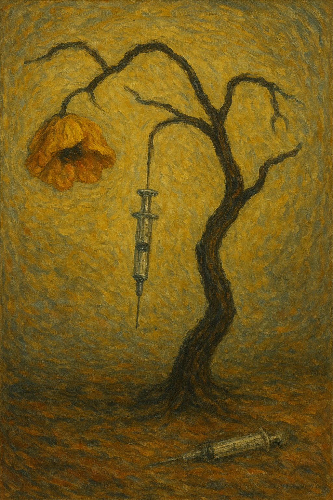

# Requiem for a dream

Darren Aronofsky’s «Requiem for a Dream» (2000) shows how four people slowly lose control of their lives, minds, and bodies because of drug addiction. [The soundtrack «Lux Aeterna»](https://youtu.be/4I-GGTCV0K0?si=bfbtQzcWD52OO94N
) is more than just background music - it expresses the obsessive and repetitive nature of addiction. When the characters use drugs, the scenes are edited with the famous ‘hip-hop montage’ technique, which shows short, fast cuts of each action. In these moments, «Lux Aeterna» doesn’t just build tension; it becomes the rhythm that drives the quick editing and helps the audience feel the speed and chaos of addiction. The repeated musical patterns and rising intensity symbolize the ritual-like behavior of drug use and the endless cycle of addiction. The layers of strings and constant beat create a heavy, tense mood that reflects the characters’ inner obsession and their unstoppable fall. Together with the visuals, the music gives the whole film a rhythm that makes the audience experience the pain and madness of addiction in both sight and sound.

In another work that depicts loss of voluntary control over behavior, Ravel’s [Boléro](baek-jaehyuk.md) also uses music in a similar way to express obsessive repetition and internal tension. In Requiem for a dream, «Lux Aeterna» mirrors the ritualistic, chaotic patterns of drug use, syncing with fast-cut visuals to immerse the audience in the compulsive cycles of addiction. Similarly, in Boléro, the unchanging rhythm and gradual crescendo symbolize obsessive persistence and mounting internal tension, reflecting the composer’s struggle with neurological decline. In both works, repetition in music emphasizes compulsion, whether through the destructive habits of addiction or the relentless build of internal pressure. This demonstrates how music can embody psychological and behavioral obsession, making the audience feel the movie characters’ or composer’s lack of control.

다렌 아로노프스키 감독의 레퀴엠 (Requiem for a Dream, 2000)은 네 명의 주인공이 마약 중독으로 인해 점점 삶과 정신, 신체를 잃어가는 과정을 보여준다. [사운드트랙 «Lux Aeterna»](https://youtu.be/4I-GGTCV0K0?si=bfbtQzcWD52OO94N)는 단순한 배경음악이 아니라, 중독의 집착적이고 반복적인 성격을 음악으로 표현한다. 특히 약물을 사용하는 장면은 빠르고 감각적인 컷으로 이어지는 ‘힙합 몽타주(hip-hop montage)’ 기법으로 구성되어 있는데, 이때 «Lux Aeterna»는 단순히 분위기를 높이는 것을 넘어서 영화의 빠른 편집 리듬을 이끌며 중독의 혼란스러운 속도를 관객이 직접 느끼게 한다. 음악의 반복되는 패턴과 점점 커지는 긴장감은 마약 사용이 반복되는 ‘의례적 행동’을 상징하고, 중독의 끝없는 순환을 표현한다. 또한 현악기의 겹겹이 쌓인 음향과 일정한 리듬은 인물들의 내면적 불안과 집착, 그리고 파괴적인 추락의 흐름을 잘 드러낸다. 이렇게 음악과 영상이 함께 어우러져, 관객은 주인공들의 중독이 가져오는 심리적·육체적 고통을 더 깊이 느낄 수 있다.

자발적 행동 통제 상실을 보여주는 또 다른 작품인 라벨의 [볼레로](baek-jaehyuk.md)에서도 음악은 집착적 반복과 내적 긴장을 표현하는 방식으로 사용된다. 영화 레퀴엠 (Requiem for a dream)에서 «Lux Aeterna»는 마약 사용의 의례적이고 혼란스러운 패턴을 그대로 반영하며, 빠른 편집 장면과 맞물려 관객이 중독의 강박적 순환을 몸으로 느끼도록 한다. 마찬가지로 볼레로에서는 일정한 리듬과 점진적 크레셴도가 집요한 지속성과 점점 커지는 내적 긴장을 상징하며, 작곡가가 신경학적 퇴행으로 겪은 통제력 상실을 반영한다. 두 작품 모두 음악 속 반복은 강박적 행동을 강조하며, 관객이 영화 주인공이나 작곡가의 통제력 상실을 직접 체감하게 만든다. 이렇게 음악은 심리적·행동적 집착을 시청각적으로 구현한다.
