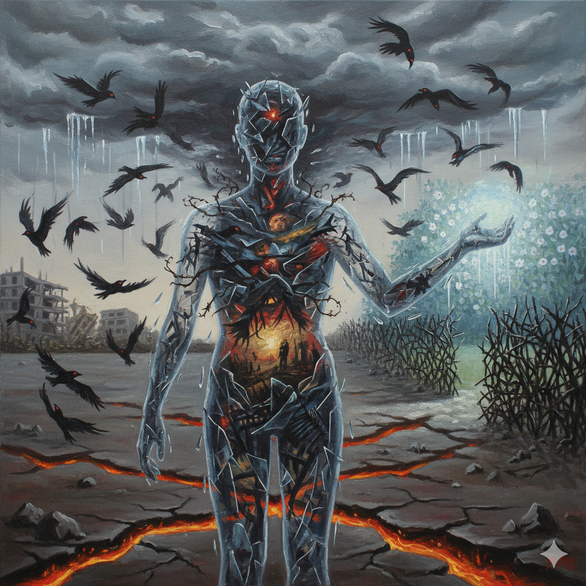

# Doctor Romantic 

In a Korean Drama called Doctor Romantic (2016), Dr. Yoon Seo-jung suffers from PTSD caused by a past accident, which triggers hyperarousal and seizures whenever she enters an operating room or sees blood or surgical instruments. She often becomes trapped in traumatic memories and runs out of the operating room. However, after meeting her mentor, Dr. Kim Sabu, she gradually learns to confront herself again. Eventually, she participates in a large and critical surgery, symbolizing her triumph over trauma.
In a Korean Drama called [Doctor Romantic](https://www.youtube.com/watch?v=3FFcjNsuKMo&list=RD3FFcjNsuKMo&start_radio=1) (2016), Dr. Yoon Seo-jung suffers from PTSD caused by a past accident, which triggers hyperarousal and seizures whenever she enters an operating room or sees blood or surgical instruments. She often becomes trapped in traumatic memories and runs out of the operating room. However, after meeting her mentor, Dr. Kim Sabu, she gradually learns to confront herself again. Eventually, she participates in a large and critical surgery, symbolizing her triumph over trauma. This OST 'Hope of Hospital' is by artist 'Ahn Su Wan' and 'Jeon Chang Yeop', and was released in 2017. 

During this scene, the OST “Hope of Hospital” amplifies Yoon Seo-jung’s emotional transformation. As she focuses on the operation and overcomes her fear, the main melody of “Hope of Hospital” emerges, symbolizing her psychological shift from fear to hope. The dramatic and uplifting melody accentuates Yoon Seo-jung’s journey of overcoming PTSD, making her recovery even more moving and powerful.

Similarly, “My Time,” the ending theme of [OMORI](woo-seunghun.md) (2020), is a piece that sonically embodies trauma and psychological collapse. On the surface, the song features a bright and cheerful electronic pop melody, yet it plays during the scene in which the protagonist fails to overcome his past wounds and guilt, ultimately falling into despair. The lyric “Close your eyes... Oyasumi” symbolizes a distorted sense of comfort that frames death as a form of rest, while the gradual breakdown of the melody into glitch-like noise in the latter half of the track audibly represents the process of the self being destroyed by trauma. Both works portray an inner journey of confronting or evading trauma through music; however, while Yoon Seo-jung’s story moves toward healing and recovery, OMORI concludes with collapse and hopelessness, presenting a starkly contrasting emotional trajectory.
Similarly, “My Time,” the ending theme of [OMORI](woo-seunghun.md) (2020), is a piece that sonically embodies trauma and psychological collapse. On the surface, the song features a bright and cheerful electronic pop melody, yet it plays during the scene in which the protagonist fails to overcome his past wounds and guilt, ultimately falling into despair. “My Time” uses a deceptively upbeat synth tone layered with a repetitive, almost mechanical beat that gradually destabilizes; this rhythmic disintegration foreshadows the breakdown that later erupts into glitch noise. The lyric “Close your eyes... Oyasumi” symbolizes a distorted sense of comfort that frames death as a form of rest, while the gradual breakdown of the melody into glitch-like noise in the latter half of the track audibly represents the process of the self being destroyed by trauma. Both works portray an inner journey of confronting or evading trauma through music; however, while Yoon Seo-jung’s story moves toward healing and recovery, OMORI concludes with collapse and hopelessness, presenting a starkly contrasting emotional trajectory.

# 낭만닥터 김사부

드라마 낭만닥터 김사부 (2016)에서 의사 윤서정은 과거 사고 트라우마로 인해 수술실에 들어가거나, 피 혹은 수술용 메스를 볼 때마다 PTSD로 인한 과각성 상태와 발작을 일으키거나 과거 기억에 사로잡혀 수술실을 뛰쳐나가곤 한다. 그러나 스승인 김사부를 만나며 그는 점차 자신을 다시 직면하는 법을 배우고, 결국에는 규모가 크고 중요한 수술에 참여하며 트라우마를 극복하는 모습을 보여준다. 결국 윤서정은 상처를 안고도 성장하는 모습을 통해 인간적 회복과 치유의 의미를 보여준다. 윤서정이 더 이상 수술실에서 발작을 일으키지 않고 용기있게 수술을 잘 해내는 장면에서 흐르는 OST Hope of Hospital 은 윤서정의 내면 변화를 감정적으로 극대화한다.
드라마 [낭만닥터 김사부](https://www.youtube.com/watch?v=3FFcjNsuKMo&list=RD3FFcjNsuKMo&start_radio=1) (2016)에서 의사 윤서정은 과거 사고 트라우마로 인해 수술실에 들어가거나, 피 혹은 수술용 메스를 볼 때마다 PTSD로 인한 과각성 상태와 발작을 일으키거나 과거 기억에 사로잡혀 수술실을 뛰쳐나가곤 한다. 그러나 스승인 김사부를 만나며 그는 점차 자신을 다시 직면하는 법을 배우고, 결국에는 규모가 크고 중요한 수술에 참여하며 트라우마를 극복하는 모습을 보여준다. 결국 윤서정은 상처를 안고도 성장하는 모습을 통해 인간적 회복과 치유의 의미를 보여준다. 윤서정이 더 이상 수술실에서 발작을 일으키지 않고 용기있게 수술을 잘 해내는 장면에서 흐르는 OST Hope of Hospital 은 윤서정의 내면 변화를 감정적으로 극대화한다. OST 'Hope of Hospital'은 안수완, 전창엽이 작곡하였으며 2017년 발매되었다. 
윤서정이 수술에 집중하며 과거의 공포를 이겨내는 순간, ‘hope of hospital’의 대표적 멜로디가 등장하며, 이는 윤서정이 공포에서 희망으로 나아가는 심리적 전환점을 상징한다. 극적이고 정의적인 멜로디로 PTSD를 이겨낸 윤서정의 여정을 더 돋보이게 만들어준다.

비슷하게, [OMORI](woo-seunghun.md) (2020)의 엔딩곡 My Time 역시 트라우마와 내면 붕괴를 음악으로 표현한 작품이다. 이 곡은 겉보기에는 밝고 경쾌한 일렉트로닉 팝 멜로디를 띠지만, 주인공이 과거의 상처와 죄책감을 이기지 못하고 절망에 빠지는 장면에서 재생된다. “Close your eyes... Oyasumi(눈을 감아... 잘 자)”라는 가사는 죽음을 휴식처럼 포장하는 왜곡된 긍정을 상징하며, 곡의 후반부에서 멜로디가 점차 글리치 노이즈처럼 붕괴되는 구조는 트라우마가 자아를 무너뜨리는 과정을 청각적으로 보여준다. 두 작품 모두 음악을 통해 인물의 트라우마를 직면하거나 회피하는 내면의 여정을 그리지만, 윤서정의 이야기가 치유와 회복으로 나아가는 반면, OMORI는 붕괴와 절망으로 끝난다는 점에서 상반된 정서를 보여준다.
비슷하게, [OMORI](woo-seunghun.md) (2020)의 엔딩곡 My Time 역시 트라우마와 내면 붕괴를 음악으로 표현한 작품이다. 이 곡은 겉보기에는 밝고 경쾌한 일렉트로닉 팝 멜로디를 띠지만, 주인공이 과거의 상처와 죄책감을 이기지 못하고 절망에 빠지는 장면에서 재생된다. 특히 이 곡은 경쾌한 신스와 반복적인 비트가 점차 흔들리고 일그러지는 음향적 변형을 통해, 표면의 밝음 아래서 내부의 균열이 서서히 확장되는 느낌을 만들어낸다. “Close your eyes... Oyasumi(눈을 감아... 잘 자)”라는 가사는 죽음을 휴식처럼 포장하는 왜곡된 긍정을 상징하며, 곡의 후반부에서 멜로디가 점차 글리치 노이즈처럼 붕괴되는 구조는 트라우마가 자아를 무너뜨리는 과정을 청각적으로 보여준다. 두 작품 모두 음악을 통해 인물의 트라우마를 직면하거나 회피하는 내면의 여정을 그리지만, 윤서정의 이야기가 치유와 회복으로 나아가는 반면, OMORI는 붕괴와 절망으로 끝난다는 점에서 상반된 정서를 보여준다.
