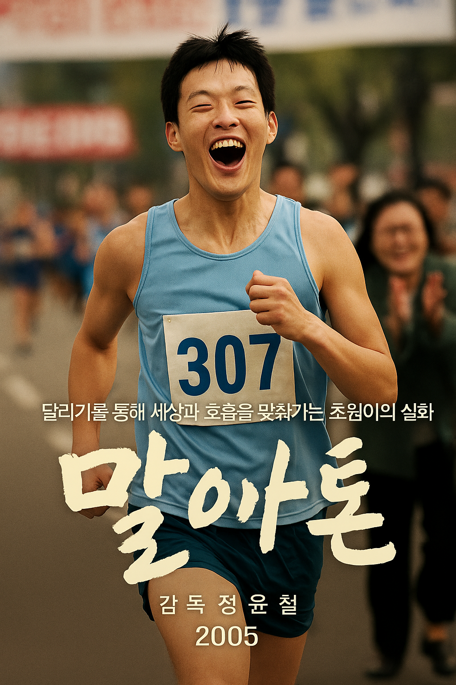

# Marathon
Title: [Run, Cho-won](https://www.youtube.com/watch?v=6nM9hL95LzA&list=RD6nM9hL95LzA&start_radio=1)  
Composer: Kim Joon-sung (1971– )  
Work: Film “Marathon” (dir. Jung Yoon-chul, 2005)  
Genre: Orchestral instrumental  
Lyrics: None (pure instrumental)  
Synopsis: Based on a true story, the film Marathon portrays a young man on the autism spectrum, Cho-won, learning to breathe with the world through running. The score translates this journey into an “order of rhythm.” At the start, the piano repeats a simple ostinato in the middle register—metronomic quarter notes with light pedal and a 2+2 phrasing—evoking Cho-won’s repetitive routines and inward focus. As training begins, a thin layer of strings doubles the piano, subtly warming the harmony and hinting at an emotional turn in which repetition becomes structure rather than isolation. In scenes of conflict with the coach or moments of sensory overload, brass and low strings thicken, and gentle syncopations rub against the piano’s regular pulse, creating a friction of dissonance. When his mother begins to attune to Cho-won’s sense of time, woodwinds softly imitate the piano motif like an echo, and the texture briefly thins, opening space for understanding and empathy. As repeated practice turns into propulsion, bass drum and soft snare add a heartbeat-like pulse, while the harmony widens its intervals to suggest a release of perspective. On race day the orchestra swells like the noise of the crowd, yet the piano line holds almost unchanged, letting the listener hear the alignment—not erasure—of the world’s beat with his inner meter. In the final stretch, high strings lift the ostinato upward and the tempo feels a shade lighter, drawing Cho-won’s steps from dissonance toward consonance, from isolation toward relation. In the coda the solo piano returns, softer than at the opening, leaving a quiet afterimage that completes the film’s stance: disability is not merely something to overcome but another order of sensation to be respected.

# 말아톤
음악 제목: [달려라, 초원](https://www.youtube.com/watch?v=6nM9hL95LzA&list=RD6nM9hL95LzA&start_radio=1)  
작곡가: 김준성 (Kim Joon-sung, 1971– )  
작품: 영화 〈말아톤〉 (감독 정윤철, 2005)  
장르: 오케스트라 기반 연주곡 (Instrumental)  
가사: 없음 (순수 연주곡)  
줄거리: 실화 기반의 영화 〈말아톤〉은 자폐성 장애를 지닌 청년 초원이 달리기를 통해 세상과 호흡을 맞춰가는 과정을 그린다. 음악은 이를 “리듬의 질서”로 번역한다. 초반, 피아노는 중음역에서 메트로놈처럼 ‘쿼터노트-쿼터노트’로 이어지는 단순 오스티나토(가벼운 페달, 2+2 프레이징)를 반복하며 초원의 반복적 일상과 내적 집중을 그린다. 훈련이 시작되면 현악의 얇은 더블링이 붙어 화성의 온도가 미세하게 따뜻해지고, 이는 “반복=고립”이 아니라 “반복=구조”로 전환되는 감정 변화를 암시한다. 코치와의 갈등이나 감각 과부하 장면에선 브라스와 저현이 두터워지고 약한 싱코페이션이 피아노의 규칙적 박과 비벼지며 불협의 마찰을 만든다. 어머니가 초원의 시간 감각에 맞춰주기 시작하면 목관이 피아노 동기를 부드럽게 모방하고(에코처럼), 텍스처가 잠시 비워지며 이해와 공감의 틈이 열린다. 반복되는 훈련이 ‘추진력’으로 변할 때는 큰북과 여린 스네어가 심장박동 같은 펄스를 보태고, 화성은 간격을 넓혀 시야가 트인 듯한 해방감을 준다. 레이스 장면에선 군중의 소음처럼 오케스트라가 팽창하지만, 피아노는 거의 같은 선율을 흔들림 없이 유지해 “세상의 박”과 “그의 내부 박”이 충돌이 아닌 공존으로 맞물리는 감정의 정렬을 들려준다. 마지막 구간에서 현의 고음이 오스티나토를 위로 들어 올리고 템포가 한 박자 가볍게 달아오르며, 초원의 걸음은 불협에서 조화로, 고립에서 관계로 수렴한다. 그리고 코다에서 다시 홀로 남는 피아노는 시작보다 더 부드럽고 낮은 음색으로 잔상을 남기며, 장애를 극복의 대상이 아니라 ‘또 다른 감각의 질서’로 존중하라는 영화의 태도를 조용히 완성한다.

# 유사한 작품 1
[이상한 변호사 우영우](cheong-yunho.md)는 *〈말아톤〉*과 마찬가지로 자폐 스펙트럼을 지닌 인물이 세상과의 ‘호흡’을 찾아가는 여정을 그린다. 두 작품 모두 음악이 단순한 배경이 아니라 ‘내면의 질서’를 시각화하는 장치로 작동한다. 특히 우영우의 피아노 기반 리듬은 초원의 오스티나토와 닮아 있으며, 반복을 ‘고립’이 아니라 ‘질서와 조화의 언어’로 번역한다는 점에서 상통한다. 나는 이 글을 통해 반복되는 리듬이 어떻게 주인공의 정체성과 세계의 박동을 하나로 맞추는지, 그 미묘한 감정적 전환을 확인할 수 있었다.  
The analysis of [Extraordinary Attorney Woo](cheong-yunho.md) resonates closely with Marathon, as both depict protagonists on the autism spectrum finding harmony with the world through rhythm. In both, music functions as more than background—it externalizes an inner order. The piano rhythm in Woo Young-woo mirrors Cho-won’s ostinato, translating repetition from “isolation” into a “language of structure and connection.” Reading this piece reveals how recurring musical patterns synchronize the protagonist’s identity with the world’s pulse, transforming difference into resonance.

# 유사한 작품 2
[7번방의 선물](lee-jaewi.md)은 지적장애를 가진 아버지의 순수한 감정을 통해 사회적 편견을 비판한다는 점에서, *〈말아톤〉*이 장애를 새로운 감각의 질서로 재해석한 방식과 닮아 있다. 두 작품 모두 ‘결핍’보다 ‘존엄’과 ‘사랑’을 중심에 두며, 음악이 인물의 내면을 확장하는 정서적 언어로 작동한다. 이 글을 통해 나는 장애를 다루는 예술이 결국 인간성의 본질을 되묻는 행위라는 점을 다시 확인했다.  
The reflection on [“Miracle in Cell No.7”](lee-jaewi.md) parallels Marathon in its portrayal of disability not as lack but as dignity and love. Both pieces show how music and emotion restore humanity to characters often defined by prejudice. Reading it reminded me that art addressing disability ultimately asks not how to “fix” difference, but how to understand it as another form of human wholeness.

# 유사한 작품 3
[말아톤](ji-dain.md)은 내 글과 직접적으로 닿아 있다. 하지만 방준석의 음악 해석이 내 글보다 한층 더 인간적 감정의 교류에 초점을 맞춘다는 점이 흥미로웠다. 나는 피아노의 반복을 리듬의 질서로 보았지만, 이 글은 그 반복 속에 담긴 모자(母子)의 신뢰와 사랑을 강조한다. 두 시선은 결국 같은 결로 모인다. 장애를 ‘극복의 서사’가 아닌 ‘공감과 이해의 질서’로 바라본다는 점에서 말이다.  
["Marathon"](ji-dain.md)The entry connects most directly to my own. Yet, while my piece interprets the piano ostinato as a rhythmic order, this one highlights the emotional bond between mother and son embedded within that repetition. I found this perspective deeply complementary—both readings refuse to treat disability as a story of “overcoming,” instead portraying it as an order of empathy and mutual understanding.
