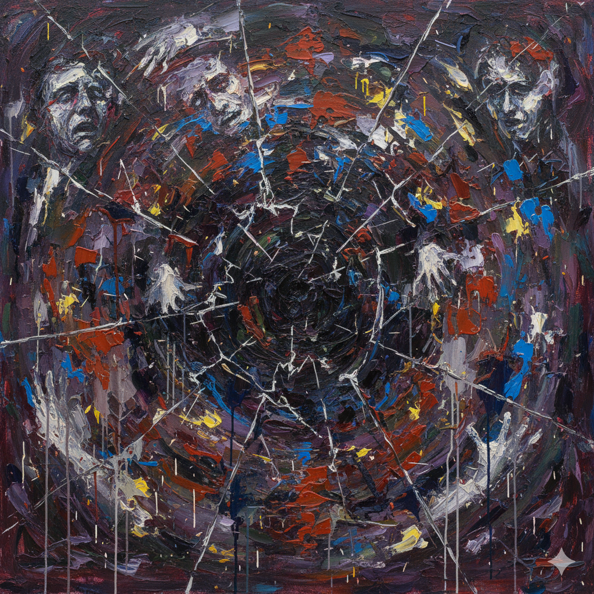

# Iron Man 3 (2013)

[The instrumental track "Isolation", composed by Brian Tyler for the Iron Man 3 (2013) soundtrack](https://youtu.be/G9TK-HOLMbs?si=evwokJGR2-YQ20ka), musically articulates the internal torment of protagonist Tony Stark. The piece underscores the Post-Traumatic Stress Disorder (PTSD), panic attacks, insomnia, and profound isolation he endures following his near-death experience during the New York incident in The Avengers. Tyler intentionally diverges from the heroic fanfares of the previous films, opting for a darker, more melodic score. Low, heavy sustained notes from the strings, dissonance, and solitary piano melodies sonically manifest Stark's unstable psychological state, while abrupt dynamic shifts effectively portray the sudden terror of his panic attacks. This music is intrinsically linked to the film's realistic narrative. The movie not only accurately portrays the clinical symptoms of PTSD but also concretely depicts Stark's dual suffering: his trauma-induced obsession with the suits colliding with the necessity of facing the threats of the Mandarin and Extremis. The core of the film's narrative is Stark's growth, as he confronts this menace and his own anxiety "as just a man"—without his suit—and ultimately overcomes them. "Isolation" powerfully conveys the depth of suffering that serves as the foundation for this growth. Thus, Iron Man 3 organically combines the realistic depiction (visualization) of trauma with its supporting musical expression (auralization), marking a significant turning point in modern superhero narratives by delving deeply into the inner psyche of a tormented hero.

# <아이언맨 3> (2013)

[영화 〈아이언맨 3(Iron Man 3)〉 OST에 수록된 브라이언 타일러(Brian Tyler)의 기악곡 "Isolation"](https://youtu.be/G9TK-HOLMbs?si=evwokJGR2-YQ20ka)은 주인공 토니 스타크의 내적 고통을 음악적으로 표현합니다. 이 곡은 〈어벤져스〉 뉴욕 사태에서 겪은 죽음의 공포가 야기한 외상 후 스트레스 장애(PTSD)와 그로 인한 공황 발작, 불면증, 고립감을 강조합니다. 타일러는 이전 시리즈의 영웅적인 팬패어 대신, 의도적으로 더 어둡고 멜로디컬한 스코어를 작곡했습니다. 낮고 묵직한 현악기의 지속음, 불협화음, 고독한 피아노 선율은 토니의 불안정한 심리를 청각적으로 구현하며, 갑작스러운 강약 대비는 공황 발작의 공포를 묘사합니다. 이 음악은 영화의 사실적인 서사와 긴밀히 연결됩니다. 영화는 PTSD의 임상 증상을 정확히 조명할 뿐만 아니라, 토니가 트라우마로 인해 슈트에 집착하면서도 '만다린'과 '익스트리미스(Extremis)'의 위협에 맞서야 하는 이중의 고통을 구체적으로 그립니다. 결국 작품의 핵심은 토니가 슈트 없이 '맨몸으로' 이 위협과 불안을 정면으로 마주하며 극복하는 성장 서사이며, "Isolation"은 그 성장의 밑바탕이 되는 고통의 깊이를 설득력 있게 전달합니다. 이처럼 〈아이언맨 3〉는 트라우마의 사실적 묘사(시각화)와 이를 뒷받침하는 음악적 표현(청각화)을 유기적으로 결합함으로써, 고뇌하는 영웅의 내면을 깊이 파고드는 현대 히어로 서사의 중요한 전환점을 보여줍니다.

---

In [The Pianist](jang-daehyeok.md), another film dealing with the trauma of World War II, music is used in a distinct and more active role. Whereas "Isolation" in Iron Man 3 focuses on 'describing' the internal symptoms of PTSD—anxiety and panic—through dark strings and dissonance, Chopin's Ballade No. 1 in The Pianist functions as the 'symbol of spiritual survival' itself, preserving the protagonist's 'identity' and 'dignity' amidst horrific trauma. The music in The Pianist, therefore, moves beyond depicting suffering to become the core medium for the theme—a 'declaration of human dignity' that confronts and transcends pain through art.

2차 세계대전의 트라우마를 다룬 또 다른 영화 [<피아니스트>](jang-daehyeok.md)에서는 음악이 이와는 구별되는, 보다 적극적인 역할로 사용됩니다. <아이언맨 3>의 "Isolation"이 PTSD의 증상인 불안과 공황을 어두운 현악기와 불협화음으로 '묘사'하며 내적 고통의 깊이를 설득하는 데 집중한다면, <피아니스트>의 쇼팽 발라드 1번은 참혹한 트라우마 속에서 주인공의 '정체성'과 '존엄'을 지켜내는 '정신적 생존의 상징' 그 자체로 기능합니다. 즉, <피아니스트>의 음악은 고통의 묘사를 넘어, 그것을 정면으로 마주하고 예술로 승화시키는 '인간 존엄의 선언'이라는 주제를 직접적으로 전달하는 핵심 매개체가 됩니다.
