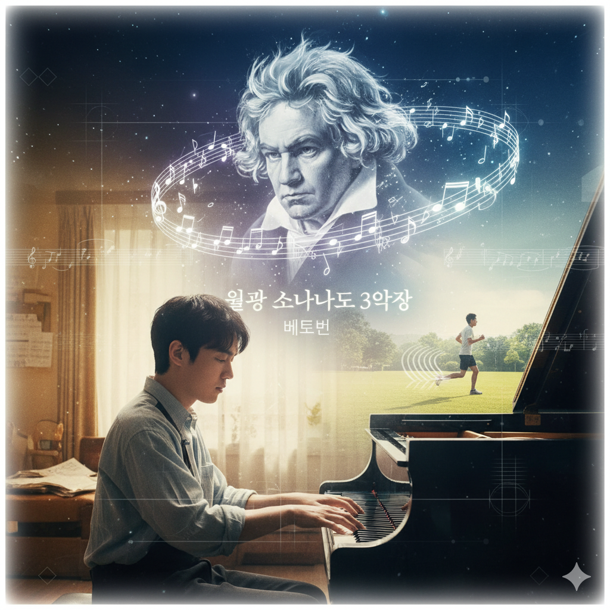

# Keys to the Heart

Title: Moonlight Sonata 3rd Movement
Composer: Beethoven
Born and Died: December 17, 1770 – March 26, 1827
Lyrics: None
Description: This movement expresses stormy passion, anguish, and anger. Unlike the 1st and 2nd movements, it begins with a very fast and intense melody, pouring out violent emotions as if depicting his passionate and desperate love for his student and lover, Giulietta Guicciardi, or perhaps Beethoven's own inner anguish and rage.

The film 'Keys to the Heart' tells the story of 'Jin-tae,' a pianist with savant syndrome, and his brother 'Jin-ho.' Jin-tae has autism spectrum disorder but displays genius-level talent at the piano. Music functions as the most powerful channel for connecting with Jin-tae's pure inner world, transcending the external limitations of disability and the breakdown of communication. The 'Moonlight Sonata 3rd Movement' that he performs—with its dark tonality of C-sharp minor, Presto agitato tempo (very fast and passionate), and storm-like structure of sixteenth-note arpeggios—explosively represents his inner world that strives to establish itself passionately despite social constraints, in complete contrast to his outward awkwardness or social difficulties. In other words, for Jin-tae, music is both a means of overcoming his disability and the most powerful and pure language through which he proves his true self beyond closed doors to the world, and it is through this melody that the audience finally encounters who he really is.

In the film '[Marathon](rho-taegang.md)', music functions as a rhythmic device that expresses the repetitive and regular world of Cho-won, who has autism. The music flowing alongside the steady beat of running acoustically embodies Cho-won's orderly way of communicating with the world, and particularly, the repetition of children's songs or simple melodies he enjoys presents autistic characteristics not as deficits but as a unique sensory world. While Jin-tae in 'Keys to the Heart' explosively reveals his inner depth through complex classical music, Cho-won in 'Marathon' constructs his own stable world through simple yet consistent rhythms. Both films share the commonality of portraying autism through music not as a 'deficiency' but as a 'different way of being'.

The scene where Jin-tae performs Moonlight Sonata 3rd Movement in the film 'Keys to the Heart' is a pivotal moment of the work, [capturing how Jin-tae, who has autism, explosively expresses his inner world through the piano](https://www.youtube.com/watch?v=jiQyA9bMHjc). Particularly, the competition scene and the duet performance with his brother Jin-ho are impressive moments that demonstrate how music becomes a tool for communication beyond disability.

# 그것만이 내 세상

제목: 월광 소나타 3악장
작곡가: 베토벤
출생 및 사망연도:  1770년 12월 17일 ~ 1827년 3월 26일
가사: 없음
줄거리: 폭풍 같은 격정과 번민, 분노를 표현한 악장입니다. 1악장과 2악장과 달리 매우 빠르고 격렬한 선율로 시작하며, 마치 제자이자 연인이었던 줄리에타 귀차르디와의 격정적이고 절망적인 사랑, 혹은 베토벤의 내면의 고뇌와 분노를 묘사하는 듯한 격렬한 감정을 쏟아냅니다. 

음악이 작품 속 질병 또는 장애를 묘사하는 방식에 관한 단상: 영화 '그것만이 내 세상'은 서번트 증후군을 가진 피아니스트 '진태'와 그의 형 '진호'의 이야기를 다룹니다. 진태는 자폐 스펙트럼 장애를 가졌지만 피아노에서는 천재적 재능을 보이는 인물입니다. 음악은 장애라는 외적 한계와 소통의 단절을 넘어 진태의 순수한 내면과 접속하는 가장 강력한 통로로 기능합니다. 그가 연주하는 '월광 소나타 3악장'은 올림다단조의 어두운 조성과 프레스토 아지타토(매우 빠르고 격정적으로)의 템포, 16분음표의 아르페지오가 폭풍처럼 몰아치는 구조를 통해, 겉보기의 어눌함이나 사회적 어려움과는 정반대로, 사회적 제약 속에서도 열정적으로 자신을 확립하려는 그의 내면세계를 폭발적으로 대변합니다. 즉, 음악은 진태에게 있어 장애를 극복하는 수단이자, 닫힌 문 너머의 자신을 세상에 증명하는 가장 강력하고 순수한 언어이며, 관객은 이 선율을 통해 비로소 그의 진짜 모습을 마주하게 됩니다.

영화 '[말아톤](rho-taegang.md)'에서 음악은 자폐를 가진 초원이의 반복적이고 규칙적인 세계를 표현하는 리듬적 장치로 기능합니다. 달리기의 일정한 박자와 함께 흐르는 음악은 초원이가 세상과 소통하는 그만의 질서정연한 방식을 청각적으로 구현하며, 특히 그가 좋아하는 동요나 단순한 멜로디의 반복은 자폐의 특성을 부정적으로 그리지 않고 하나의 고유한 감각 세계로 제시합니다. '그것만이 내 세상'의 진태가 복잡한 클래식 음악을 통해 내면의 깊이를 폭발적으로 드러낸다면, '말아톤'의 초원이는 단순하지만 일관된 리듬을 통해 자신만의 안정적인 세계를 구축합니다. 두 작품 모두 음악을 통해 자폐를 '결핍'이 아닌 '다른 방식의 존재'로 그려낸다는 점에서 공통점을 지닙니다.

영화 '그것만이 내 세상'에서 진태가 월광 소나타 3악장을 연주하는 장면은 작품의 핵심적인 순간으로, [자폐를 가진 진태가 피아노를 통해 자신의 내면을 폭발적으로 표출하는 모습](https://www.youtube.com/watch?v=jiQyA9bMHjc)을 담고 있습니다. 특히 콩쿠르 장면이나 형 진호와의 연탄곡 연주 장면은 음악이 어떻게 장애를 넘어 소통의 도구가 되는지를 보여주는 인상적인 장면입니다.
